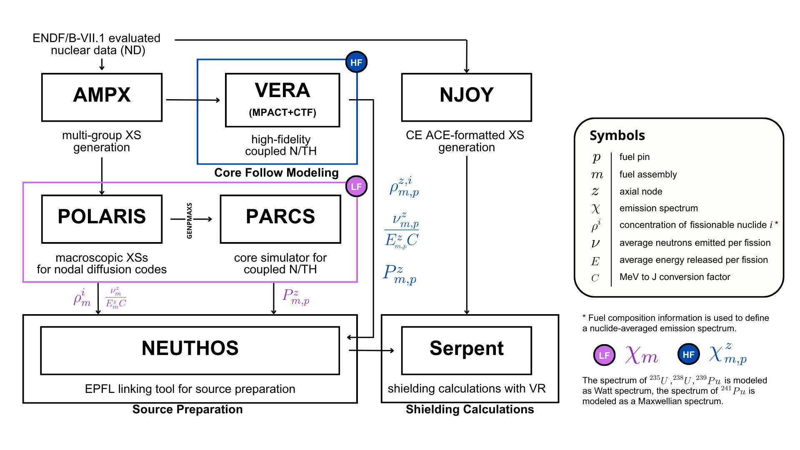

## Overview

LRS has recently developed a vessel fluence calculation methodology  
(Timpano and Hursin, 2025) based on the SCALE Polaris/PARCS code procedure
for core follow calculations, followed by Serpent for shielding simulations
with hybrid variance reduction (VR).

The methodology follows the common approach of extracting pin power
information, together with lattice-specific parameters such as the average
number of neutrons per fission and the average energy released per fission,
to reconstruct an assembly-wise or pin-wise fission source.

The emission spectrum is modeled using analytical functions describing the
four nuclides contributing to fission: **U-235**, **U-238**, **Pu-239**, and **Pu-241**.

The Watts spectrum is used for **U-235**, **U-238**, and **Pu-239**, while a
Maxwellian spectrum is used for **Pu-241**.

## NEUTHOS Source Preparation

Based on the neutron source defined for a number of state points in the core
follow calculations, the source preparation routine—named **NEUTHOS**—
averages neutron sampling probabilities and emission spectra according to
the core-average exposure, producing one effective neutron source per
reactor cycle.

The source preparation tool **NEUTHOS** is now available as an API in this
release.

## References

- Timpano, D., Hursin, M., 2025. *Development of a Polaris/PARCS/Serpent
  methodology for reactor pressure vessel neutron fluence calculations.*
  In: 18th International Symposium on Reactor Dosimetry (ISRD) [Accepted].
  ASTM International, Charleston, South Carolina, USA.

- Timpano, D., Vasiliev, A., Rochman, D., Hursin, M. *Uncertainty
  quantification for a vessel fluence calculation: A PWR case study*,
  Progress in Nuclear Energy, Volume 193, 2026, 106234,
  ISSN 0149-1970.  
  https://doi.org/10.1016/j.pnucene.2025.106234