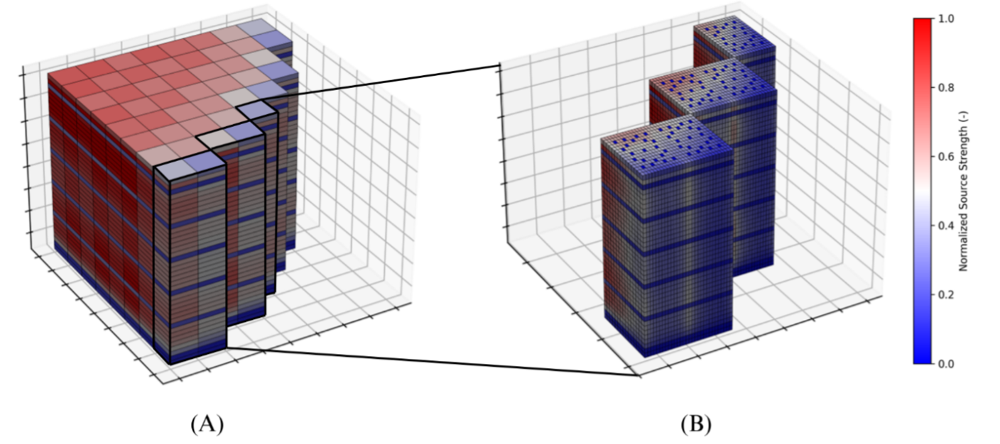

THEORY
==================

.. figure:: ../../build/html/_static/methodology_block_diagram.png
   :align: center

   Block diagram of the source preparation procedure.

The source preparation procedure follows available literature on this topic.
The pin power information for each assembly :math:`m`, pin :math:`p` and axial
layer :math:`z` in the core is converted into a fission source rate by means of
the average number of neutrons generated per fission :math:`\nu`, the energy
recoverable from fission :math:`E` (MeV) and the conversion factor :math:`C`
from MeV to J (:math:`1.6019 \times 10^{-13}` J/MeV), as shown in
Equation :eq:`eq_source_strength`.

.. math::
   :label: eq_source_strength

   S_{m,p}^z = P_{m,p}^z \frac{\nu_m^z}{E_m^z C}

Retrieval of lattice-level quantities
--------------------------------------

Retrieving the average number of neutrons per fission and the energy released
per fission requires access to quantities calculated at the lattice level and
not directly available from PARCS. For this purpose, the EPFL linking tool reads
the axial specifications in the nodal solver input to identify the corresponding
lattice and retrieve the associated quantities from its reference history in the
Polaris output files.

For any specified burnup point in the simulated cycle state points, the routine
retrieves:

* the average number of neutrons per fission :math:`\nu`,
* the energy released per fission :math:`E`,
* the nuclide concentrations :math:`\rho^i` (atom/barn-cm)

for the four fissile nuclides :math:`^{235}\mathrm{U}`, :math:`^{238}\mathrm{U}`,
:math:`^{239}\mathrm{Pu}` and :math:`^{241}\mathrm{Pu}`.

Definition of :math:`\nu_m^z` and :math:`E_m^z`
-----------------------------------------------

The specification of :math:`\nu_m^z` and :math:`E_m^z` in
Equation :eq:`eq_source_strength` can be carried out using two alternative
approaches:

* **Polaris Option**: direct use of lattice-specific values retrieved from
  Polaris;
* **Literature Option**: computation of weighted averages based on the
  macroscopic fission cross-sections of the four fissile nuclides.

For the *Literature Option*, the average number of neutrons per fission and the
energy released per fission are computed as:

.. math::
   :label: eq_nu_weighted

   \nu_m^z =
   \frac{\sum_{i=1}^4 \nu^i \rho_m^{(i,z)} \sigma_f^i}
        {\sum_{i=1}^4 \rho_m^{(i,z)} \sigma_f^i}

.. math::
   :label: eq_energy_weighted

   E_m^z =
   \frac{\sum_{i=1}^4 E^i \rho_m^{(i,z)} \sigma_f^i}
        {\sum_{i=1}^4 \rho_m^{(i,z)} \sigma_f^i}

The effective one-group microscopic fission cross-sections :math:`\sigma_f^i`
are taken from CASMO-4, where they are employed for LWR average spectrum
calculations. Different LWR spectrum weighting factors are used in the more
recent CASMO-5 release.

The average number of neutrons per fission :math:`\nu^i` and the energy released
per fission :math:`E^i` are taken from available literature. Nuclide densities
are retrieved from Polaris output as described above.

Both methods for the definition of the source strength are implemented in the
linking tool developed in this study. Their impact on fluence calculations is
briefly discussed in the section dedicated to the investigation of modeling
biases.

Source spatial definition
-------------------------

Source strengths define neutron sampling probabilities in the subsequent Monte
Carlo shielding calculations. The source preparation routine supports both:

* **pin-wise source (PWS)** definition,
* **assembly-wise source (AWS)** definition.

In the assembly-wise case, neutrons are sampled only within fuel volumes, while
the same neutron-sampling probability is assigned to each fuel axial layer,
independently of the fuel rod location inside the assembly.

   Example of assembly-wise (A) and pin-wise (B) source definition.

Source spectrum definition
--------------------------

The source definition also requires the specification of the neutron energy
spectrum, accounting for the specific fuel composition. The spectrum is defined
up to 20 MeV through an assembly-wise weighted average, according to
Equation :eq:`eq_spectrum`.

.. math::
   :label: eq_spectrum

   \chi_m(E) = \sum_{i=1}^4 w_m^i \chi^i(E)

The weights :math:`w_m^i` reflect the fractions of neutrons generated by fission
from the different nuclides:

.. math::
   :label: eq_weights

   w_m^i =
   \frac{\nu^i \rho_m^i \sigma_f^i}
        {\sum_{i=1}^4 \nu^i \rho_m^i \sigma_f^i}

The spectra :math:`\chi^i(E)` are defined assuming:

* a Watt spectrum for :math:`^{235}\mathrm{U}`, :math:`^{238}\mathrm{U}` and
  :math:`^{239}\mathrm{Pu}`,
* a Maxwellian spectrum for :math:`^{241}\mathrm{Pu}`.

The constants used in the definition of these spectra are consistent with those
reported in the Monte Carlo code MCNP documentation.

As an alternative, a **Polaris Option** for spectrum definition is available. In
this case, a reference spectrum for each lattice is extracted from a dedicated
Polaris calculation using the SCALE 252-group library. The resulting spectra are
then passed to Serpent using the same energy group structure.

Time-averaging over the reactor cycle
-------------------------------------

Once the source specifications have been determined for each of the :math:`N`
state points simulated in a reactor cycle by PARCS, source weights and spectra
are averaged based on the core-average burnup in order to obtain a single source
file per reactor cycle.

This averaging procedure is performed according to:

.. math::
   :label: eq_time_average

   \bar{q} =
   \frac{\sum_{i=1}^N q_i \Delta bu_i}
        {\sum_{i=1}^N \Delta bu_i}

where :math:`q_i` is any quantity of interest at state point :math:`i`,
:math:`\Delta bu_i` is the average core burnup increase between state points
:math:`i` and :math:`i+1` (GW/t), and :math:`\bar{q}` is the burnup-weighted
average value.

The impact of time-averaging within a reactor cycle is briefly discussed in the
section dedicated to the investigation of modeling biases.
